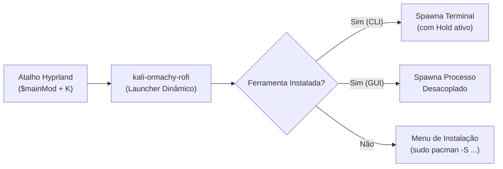

# Guia de Integração e Setup com Hyprland & Omarchy

Este guia detalha o processo completo de compilação, instalação, configuração de atalhos globais no gerenciador de janelas [Hyprland](https://hyprland.org/) e personalização do ecossistema de ferramentas do **kali-ormachy**.

---

## Sumário

1. [Visão Geral](#visão-geral)
2. [Pré-requisitos do Sistema](#pré-requisitos-do-sistema)
3. [Instalação](#instalação)
   - [Método 1: Script Automatizado (`install.sh`)](#método-1-script-automatizado-installsh)
   - [Método 2: Makefile Padrão (`make install`)](#método-2-makefile-padrão-make-install)
   - [Localização dos Arquivos Instalados](#localização-dos-arquivos-instalados)
4. [Configuração de Atalhos no Hyprland](#configuração-de-atalhos-no-hyprland)
   - [Atalho Básico Recomendado](#atalho-básico-recomendado)
   - [Atalhos Rápidos Diretos para Categorias](#atalhos-rápidos-diretos-para-categorias)
   - [Configuração de Submap (Modo Dedicado de Pentest)](#configuração-de-submap-modo-dedicado-de-pentest)
   - [Regras de Janela (Window Rules) para Wayland](#regras-de-janela-window-rules-para-wayland)
5. [Configuração de Terminal e Session Hold](#configuração-de-terminal-e-session-hold)
   - [Como Funciona o Mecanismo de Hold](#como-funciona-o-mecanismo-de-hold)
   - [Terminais Suportados Nativamente](#terminais-suportados-nativamente)
   - [Definindo o Terminal Padrão](#definindo-o-terminal-padrão)
6. [Personalização de Ferramentas e Presets (`config.toml`)](#personalização-de-ferramentas-e-presets-configtoml)
   - [Adicionando uma Nova Ferramenta](#adicionando-uma-nova-ferramenta)
   - [Diferença entre Modo CLI e GUI](#diferença-entre-modo-cli-e-gui)
7. [Solução de Problemas (Troubleshooting)](#solução-de-problemas-troubleshooting)
   - [Rofi não encontrado](#rofi-não-encontrado)
   - [Atalho $mainMod + K não responde](#atalho-mainmod--k-não-responde)
   - [Terminal fecha imediatamente após executar a ferramenta](#terminal-fecha-imediatamente-após-executar-a-ferramenta)
   - [Tema do Rofi sem estilo ou cores erradas](#tema-do-rofi-sem-estilo-ou-cores-erradas)
   - [Desinstalação](#desinstalação)

---

## Visão Geral

O **kali-ormachy** une o poder das ferramentas de auditoria e segurança ofensiva do Kali Linux à agilidade e elegância visual do ecossistema [Omarchy](https://github.com/omarchy) / Hyprland.



---

## Pré-requisitos do Sistema

Para compilar e usufruir de todas as funcionalidades, assegure-se de que os pacotes necessários estejam instalados:

| Dependência | Pacote no Arch Linux / Omarchy | Propósito |
| :--- | :--- | :--- |
| **Rust & Cargo** | `rust` ou via `rustup` | Compilação do motor de alta performance |
| **Rofi (Wayland)** | `rofi-wayland` | Interface gráfica de menus e parâmetros |
| **Terminal Wayland** | `kitty`, `alacritty` ou `foot` | Execução interativa das ferramentas CLI com hold |
| **Clipboard** | `wl-clipboard` | Cópia de comandos de instalação ausentes |
| **Notificações** | `libnotify` / `mako` / `swaync` | Feedback visual na ausência de pacotes |

> [!TIP]
> No Arch Linux / Omarchy, instale as dependências visuais com:
> ```bash
> sudo pacman -S rofi-wayland wl-clipboard libnotify kitty
> ```

---

## Instalação

### Método 1: Script Automatizado (`install.sh`)

O script `install.sh` é o método mais completo e amigável. Ele valida dependências, compila o binário em modo release, instala executáveis e temas, e se oferece para configurar automaticamente o atalho no `hyprland.conf`.

#### Instalação Padrão (Interativa)
```bash
./install.sh
```

#### Instalação Não-Interativa (Automática)
Útil para scripts de setup ou dotfiles:
```bash
./install.sh --yes
```

#### Simulação (Dry-Run)
Verifique exatamente quais arquivos serão criados sem alterar o sistema:
```bash
./install.sh --dry-run
```

#### Opções do Instalador
| Flag | Descrição |
| :--- | :--- |
| `--prefix <DIR>` | Altera o diretório base (padrão: `~/.local`, binários em `~/.local/bin`). |
| `--config-dir <DIR>` | Altera o destino da configuração (padrão: `~/.config/ormachy-kali`). |
| `--skip-hyprland` | Não altera nem adiciona atalhos ao `hyprland.conf`. |
| `--skip-build` | Utiliza o binário já compilado em `target/release/kali-ormachy`. |
| `--uninstall` | Remove todos os componentes do sistema. |
| `--purge` | Durante a desinstalação, remove também os arquivos de configuração customizados. |

---

### Método 2: Makefile Padrão (`make install`)

Para administradores e empacotadores que preferem a convenção padrão Unix:

```bash
# Compilar binário em modo release
make build

# Instalar em ~/.local/bin e ~/.config/ormachy-kali
make install

# Ou instalar globalmente no sistema (como root)
sudo make install PREFIX=/usr/local
```

Para rodar toda a suíte de testes automatizados:
```bash
make test
```

---

### Localização dos Arquivos Instalados

Após a instalação, a estrutura do seu sistema conterá:

- **`${PREFIX}/bin/kali-ormachy`**: Binário compilado em Rust de ultra-baixa latência (< 5ms).
- **`${PREFIX}/bin/kali-ormachy-rofi`**: Script integrador do menu dinâmico de 2 etapas.
- **`~/.config/ormachy-kali/config.toml`**: Catálogo completo de ferramentas e presets editável pelo usuário.
- **`~/.config/ormachy-kali/kali-ormachy.rasi`**: Folha de estilos do Rofi com herança de variáveis de tema do Omarchy.

> [!NOTE]
> Se `~/.config/ormachy-kali/config.toml` já existir no momento de uma nova instalação ou atualização, suas alterações **não serão sobrescritas**.

---

## Configuração de Atalhos no Hyprland

### Atalho Básico Recomendado

Abra seu arquivo de configuração do Hyprland:
```bash
nano ~/.config/hypr/hyprland.conf
```
*(ou `micro`, `vim`, etc.)*

Adicione a seguinte linha na seção de binds:
```ini
# ==============================================================================
# Kali-Ormachy: Launcher Dinâmico de Segurança Ofensiva
# ==============================================================================
bind = $mainMod, K, exec, kali-ormachy-rofi
```

Pressione `$mainMod + K` (geralmente `Super + K`) para abrir o seletor visual de categorias.

> [!IMPORTANT]
> Certifique-se de que `~/.local/bin` está presente no `PATH` das sessões do seu usuário. Caso o Hyprland não encontre o comando, utilize o caminho absoluto:
> ```ini
> bind = $mainMod, K, exec, ~/.local/bin/kali-ormachy-rofi
> ```

---

### Atalhos Rápidos Diretos para Categorias

Você pode criar atalhos dedicados para categorias específicas usando a flag `--category`:

```ini
# Abre diretamente a categoria Redes & Wi-Fi ($mainMod + Shift + N)
bind = $mainMod SHIFT, N, exec, kali-ormachy-rofi --category network

# Abre diretamente a categoria Aplicações Web ($mainMod + Shift + W)
bind = $mainMod SHIFT, W, exec, kali-ormachy-rofi --category web

# Abre diretamente a categoria Engenharia Reversa ($mainMod + Shift + R)
bind = $mainMod SHIFT, R, exec, kali-ormachy-rofi --category reverse
```

---

### Configuração de Submap (Modo Dedicado de Pentest)

Para usuários avançados que desejam uma experiência modal (estilo vim) para testes de invasão:

```ini
# Entra no submap de Pentest com $mainMod + P
bind = $mainMod, P, submap, pentest

submap = pentest

# Teclas de atalho no modo Pentest:
bind = , K, exec, kali-ormachy-rofi
bind = , K, submap, reset

bind = , N, exec, kali-ormachy-rofi --category network
bind = , N, submap, reset

bind = , W, exec, kali-ormachy-rofi --category web
bind = , W, submap, reset

# Pressione ESC para cancelar e sair do modo
bind = , escape, submap, reset

submap = reset
```

---

### Regras de Janela (Window Rules) para Wayland

Para garantir que o menu do Rofi apareça centralizado e sem decorações inadequadas, adicione as regras ao `hyprland.conf`:

```ini
# Regras de janela para o Rofi no Hyprland
windowrulev2 = stayfocused, class:^(Rofi)$
windowrulev2 = float, class:^(Rofi)$
windowrulev2 = pin, class:^(Rofi)$
```

---

## Configuração de Terminal e Session Hold

### Como Funciona o Mecanismo de Hold

Ao executar uma ferramenta CLI (como `nmap`, `aircrack-ng` ou `sqlmap`), o comando encerra e normalmente fecha a janela do terminal instantaneamente. Com o **kali-ormachy**, o motor inteligente do runner preserva a sessão aberta para que você possa analisar logs, saídas e relatórios com tranquilidade.

### Terminais Suportados Nativamente

O motor Rust detecta automaticamente o emulador de terminal disponível e utiliza suas flags nativas de persistência:

| Terminal | Flag Nativa Utilizada | Comportamento |
| :--- | :--- | :--- |
| **Kitty** | `kitty --hold -e <cmd>` | Nativo, preserva buffer e histórico |
| **Alacritty** | `alacritty --hold -e <cmd>` | Nativo |
| **Foot** | `foot --hold <cmd>` | Nativo, ultraleve para Wayland |
| **Ghostty** | Wrapper com fallback interativo | Aguarda pressionamento de tecla |
| **Outros / Genérico** | `sh -c '<cmd>; echo "[Process finished]"; read'` | Fallback universal |

### Definindo o Terminal Padrão

Caso você tenha múltiplos emuladores instalados e queira fixar um terminal preferido, defina-o em `~/.config/ormachy-kali/config.toml`:

```toml
[settings]
terminal = "kitty"  # Opções: "kitty", "alacritty", "foot", "ghostty", etc.
```

---

## Personalização de Ferramentas e Presets (`config.toml`)

O catálogo é totalmente personalizável. Você pode adicionar suas ferramentas favoritas do Kali ou do AUR.

### Adicionando uma Nova Ferramenta

Abra `~/.config/ormachy-kali/config.toml` e adicione um novo bloco `[[tools]]`:

```toml
[[tools]]
name = "Gobuster"
category = "web"
description = "Ferramenta de força bruta para URIs e DNS"
binary = "gobuster"
package = "gobuster"
mode = "cli"

  [[tools.presets]]
  name = "Scan de Diretórios HTTP"
  description = "Enumera endpoints e arquivos em servidor web"
  command = "gobuster dir -u {url} -w {wordlist}"
  hold = true

    [[tools.presets.params]]
    name = "url"
    description = "URL alvo (ex: http://10.10.10.10)"
    default = "http://localhost"

    [[tools.presets.params]]
    name = "wordlist"
    description = "Caminho da wordlist"
    default = "/usr/share/wordlists/dirb/common.txt"
```

### Diferença entre Modo CLI e GUI

- **`mode = "cli"`**: O comando será disparado dentro de um terminal Wayland com suporte a `hold`.
- **`mode = "gui"`**: Aplicações gráficas (como `Wireshark`, `Burp Suite`, `Ghidra`) são executadas em segundo plano desvinculadas de qualquer janela de terminal.

---

## Solução de Problemas (Troubleshooting)

### Rofi não encontrado

**Sintoma:** Ao pressionar o atalho, nada acontece ou surge a notificação *"Rofi não encontrado no sistema"*.  
**Solução:**
Instale o Rofi para Wayland:
```bash
sudo pacman -S rofi-wayland
```

---

### Atalho $mainMod + K não responde

**Sintoma:** Pressionar a tecla Super + K não abre o menu.  
**Causas e Resoluções:**
1. **Verifique se o executável está no PATH:**
   ```bash
   which kali-ormachy-rofi
   ```
   Se retornar erro, assegure-se de que `~/.local/bin` está no seu `PATH` ou use o caminho absoluto no `hyprland.conf`:
   ```ini
   bind = $mainMod, K, exec, ~/.local/bin/kali-ormachy-rofi
   ```
2. **Recarregue as configurações do Hyprland:**
   ```bash
   hyprctl reload
   ```

---

### Terminal fecha imediatamente após executar a ferramenta

**Sintoma:** O comando roda mas a janela do terminal desaparece em seguida.  
**Solução:**
Verifique se o preset correspondente no arquivo `config.toml` possui `hold = true`:
```toml
[[tools.presets]]
name = "Meu Preset"
command = "..."
hold = true
```

---

### Tema do Rofi sem estilo ou cores erradas

**Sintoma:** O menu aparece com estilo cinza padrão básico do X11 ou não herda as cores do Omarchy.  
**Solução:**
O tema `kali-ormachy.rasi` herda a configuração base do sistema via `@import "~/.config/rofi/config.rasi"`.
Verifique se o diretório do Rofi existe:
```bash
mkdir -p ~/.config/rofi
touch ~/.config/rofi/config.rasi
```
Você também pode forçar um tema específico via variável de ambiente:
```bash
export ROFI_THEME=~/.config/ormachy-kali/kali-ormachy.rasi
```

---

### Desinstalação

Para remover o kali-ormachy do seu sistema:

```bash
# Mantendo seus arquivos de configuração personalizados
./install.sh --uninstall

# Ou removendo completamente, incluindo arquivos de configuração
./install.sh --uninstall --purge
```

Ou através do Makefile:
```bash
make uninstall
```
